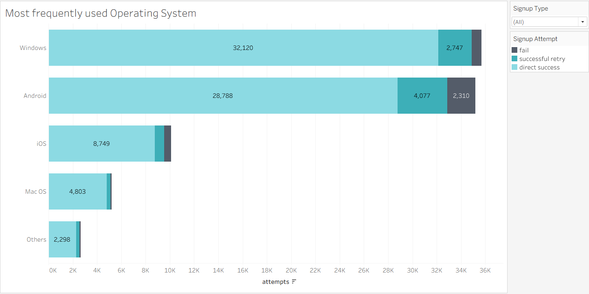
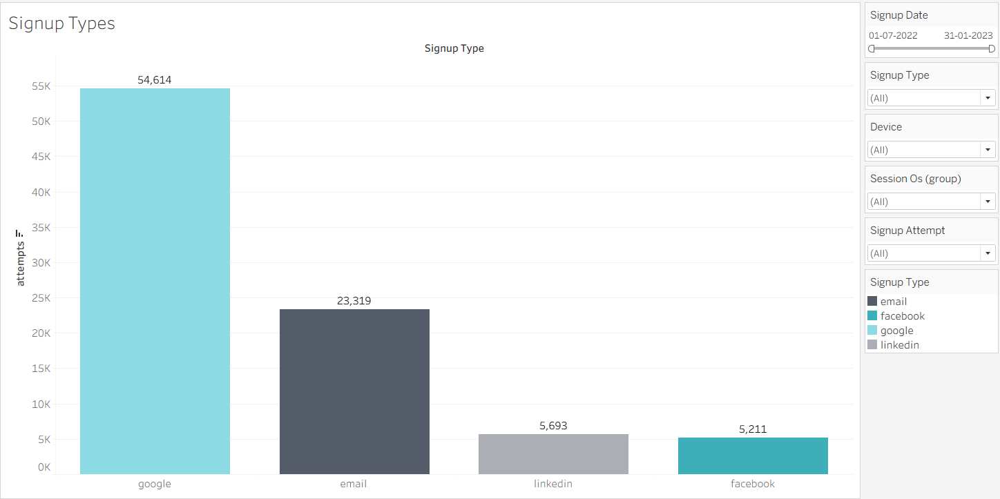
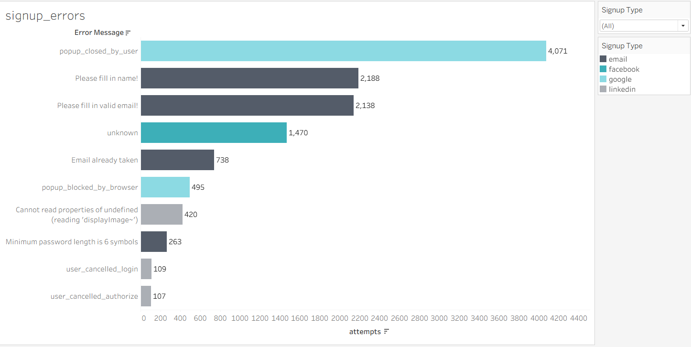

# Sign-Up Flow Optimization Analysis

## Overview

This project delivers a comprehensive analysis of the **user sign-up flow**, focusing on error patterns, device-level performance, and platform-specific drop-offs.  
The goal is to understand where users struggle during registration and identify opportunities to increase **visitor-to-free conversion rates**.

The findings are derived from actual platform event data under the **365 platform**, highlighting both technical and behavioral friction points within the sign-up process.

### 📁 Analysis File  
Access the full analysis report here:  
[Analysis Report.pdf](Analysis_report/Analysis%20Report.pdf)

---

## Tools & Techniques

This project leveraged:

- **📊 Exploratory data analysis (EDA)**
- **📈 Funnel performance review**
- **❗ Error pattern segmentation**
- **📱 Device & OS–level behavior analysis**
- **🧩 Sign-up method comparison (Google, Facebook, LinkedIn)**

---

## Dataset Description

The dataset includes detailed user behavior logs related to:

- **🔐 Sign-up attempts & retry events**
- **📱 Device type (Desktop / Mobile)**
- **🖥️ Operating system distribution**
- **🔗 Social sign-up methods (Google, Facebook, LinkedIn)**
- **📧 Email input errors & password failures**
- **🚫 Closed pop-ups and other external interruptions**

This foundation enabled a clear picture of why sign-ups fail, and where optimizations can be made.

---

## Sign-Up Flow Findings

### 📊 Sign-Up Failure Trends

#### **1. Device-Level Failure Rates (Bar Chart)**

- **Desktop Failure Rate:** 1.16%  
- **Mobile Failure Rate:** 3.24%  
- **Insight:** Mobile users struggle significantly more, mainly due to data entry issues.

---

#### **2. OS-Wise Performance**

- **Highest failed attempts:** **Android — 2,309 fails**  
- **Highest successful retries:** **Android — 4,077 retries**  
- **Insight:** Android users face the most difficulty but are also the most persistent.

---

#### **3. Sign-Up Method Comparison**

| Method     | Success Rate | Fail Rate |
|------------|--------------|-----------|
| Google     | 91%          | 3.2%      |
| LinkedIn   | 87%          | —         |
| Facebook   | 69%          | 7.6%      |
| Email      | 65%          | 6.2%      |

- 💡 **Google has the lowest failure rate and highest preference.**  
- ⚠️ **Email has the most friction**, especially on mobile.

---

### 📱 Email Input Issues (Major Pain Point)

- **Total email fails:** 1,508  
- **Email fails on mobile:** 1,273  
- **85% of email errors related to incorrect input fields**  
  → Users struggle to type email details on smaller screens.

---

### 🔄 Pop-up Issues & External Factors

- **Google pop-ups closed prematurely:** 778 users  
- **Facebook unknown errors:** 349  
- **Windows & Android account for most Google-related errors (11,598)**  
- **11,460 errors specifically indicate “popup closed by user”**

These highlight common **external-interruption failures** affecting conversions.

---

## Business Objective

The primary aim is to **boost visitor-to-free conversion rate**, contributing to a larger pool of registered free users and supporting long-term business growth.

---

## Hypothesis

> **If social media sign-up options are given more prominence on the webpage, the visitor-to-free conversion rate will increase, resulting in more free registered users.**

Based on user behavior, social sign-ups (Google/LinkedIn) outperform email in both popularity and success rate, supporting this hypothesis.

---

## Opportunity Sizing

### 📈 Expected Impact of Highlighting Social Sign-Ups

- **Anticipated lift:** +10% to current conversion rate  
- **Conversion improvement:** from **3.2% → ~3.52%**  
- **Estimated additional users:** **+3,587 free registrations** (at current traffic levels)

### 💰 Revenue Forecast (Per 10,000 Visitors)

- **+14 additional paid users** expected  
- **At $30 per subscription:** **+$420 additional revenue**  
- **Long-term scaling:** Significant cumulative gain across quarters.

---

## Actionable Insights

### ✔ 1. Emphasize Social Sign-Up Options  
Highlight Google & LinkedIn more prominently (low failure rates & higher user preference).

### ✔ 2. Simplify Email Sign-Up  
Reduce friction by optimizing field inputs and reducing complexity on mobile.

### ✔ 3. Relax Strict Password Requirements  
High rejection suggests that overly strict rules contribute to drop-offs.

### ✔ 4. Improve Password Restoration Flow  
Make recovery simpler to reduce abandonment at login.

### ✔ 5. Investigate Facebook “Unknown Errors”  
Identify root causes of the 349 unexplained failures to patch inconsistencies.

---

## Conclusion

This analysis identifies substantial friction in the sign-up flow, especially in mobile email registration and pop-up interruptions.  
By simplifying the email journey and elevating the visibility of higher-performing social sign-up methods, the platform can meaningfully improve conversion rates, grow its free-user base, and gain incremental revenue.

---

